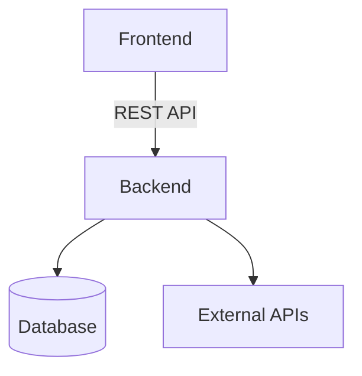

# 🧠 Capping Project: [Project Title]

## 👥 Team Members
| Name | Role | Email |
|------|------|--------|
| Student 1 | Project Manager / Backend Developer | |
| Student 2 | Frontend Developer | |
| Student 3 | Data Engineer / QA | |
| Faculty Advisor | [Professor Name] | |

---

## 🧭 Project Overview

### Abstract
A concise 150–250-word summary describing:
- The problem being addressed  
- The solution developed  
- Technologies used  
- Expected outcomes and impact  

### Motivation
Explain the context or need for the project.  
Why is this problem worth solving? Who benefits?

### Objectives
List the main goals and measurable objectives of your system.

### Scope
Define what the system will include and what it will **not** include.

---

## 📚 Background and Research
Summarize any prior work, similar systems, or research papers you reviewed.  
Identify key gaps your solution addresses.

> 📖 Cite sources using IEEE or APA format if applicable.

---

## ⚙️ System Design and Architecture

### Functional Requirements
Describe **what** the system must do.
- Example: Users can register and log in securely.  
- Example: The system generates weekly analytics reports.

### Non-Functional Requirements
Performance, security, usability, scalability, and maintainability criteria.

### Use Cases / User Stories
Provide 2–4 key use cases or user stories.  
Optionally include a diagram (`/docs/use_cases.png`).

### System Architecture
High-level overview of the system components and interactions.  
Embed your architecture diagram here:



### Technology Stack

|Layer|Technology|
|-----|----------|
|Frontend|React / JavaFX / HTML+CSS+JS|
|Backend|Node.js / Spring Boot / Flask|
|Database|PostgreSQL / MongoDB|
|Tools|Docker / GitHub Actions / AWS / Firebase|

---

## 💾 Data Design
- Include your ER diagram (/docs/er_diagram.png)
- Provide a database schema or key table descriptions
- Explain any external datasets or APIs used

---

## 💻 Implementation Details

### Development Methodology

Describe your process (Agile, Scrum, Kanban, etc.) and sprint structure.

### Core Features

List and briefly describe main features or modules implemented.

### API Documentation

Provide sample endpoints if applicable.
```
GET /api/users
POST /api/login
```
Include full docs in `/docs/api_reference.md`.

### Repository Structure
```
📦 project-root
 ┣ 📂 src
 ┣ 📂 docs
 ┣ 📂 tests
 ┣ 📜 README.md
 ┣ 📜 requirements.txt / pom.xml / package.json
 ┗ 📜 LICENSE
```

---

## 🧪 Testing and Quality Assurance

### Testing Approach

Explain your strategy for unit, integration, and user testing.

### Sample Test Case

|Test ID|Description|Input|Expected Output|Result|
|-------|-----------|-----|---------------|------|
|TC-01|Login with valid credentials|user/pass|Dashboard|loads|Pass|

### Tools

JUnit, Postman, Jest, Selenium, PyTest, etc.

---

## 🚀 Deployment

### Setup and Installation
```
git clone https://github.com/[org]/[repo].git
cd [repo]
npm install      # or mvn clean install / pip install -r requirements.txt
npm start        # or mvn spring-boot:run / python app.py
```

### Environment Variables
```
DB_HOST=
DB_USER=
DB_PASS=
API_KEY=
```
### Deployment Notes
- Hosting environment (AWS, Render, Heroku, etc.)
- Dockerfile or CI/CD configuration (.github/workflows/)

---

## 📊 Results and Evaluation

|Goal|Achieved|Evidence|
|----|--------|--------|
|Implement secure login|✅|Auth tests passed|
|Deploy cloud instance|✅|Running on AWS EC2|
|Optimize performance|In progress|Load test results pending|

Include screenshots, metrics, or performance charts here.

---

## 🧩 Lessons Learned
- Technical challenges encountered
- Project management takeaways
- Recommendations for future teams

---

## 🔮 Future Work
- Planned enhancements
- Features not yet implemented
- Potential research extensions

---

## 📎 Appendices
- User Manual
- Installation Guide
- Test Report
- Ethical and Privacy Considerations

---

## 🧾 References

List all external resources, libraries, and citations.

---

## 🏁 Acknowledgments

Thanks to mentors, faculty advisors, and collaborators who supported the project.

---

## 📅 Project Timeline

|Milestone|Deliverable|Date|
|---------|-----------|----|
|Proposal Approved| Problem Statement & Plan|Sept 10|
|Midterm Demo|Prototype & Report|Oct 28|
|Final Submission|Full System & Report|Dec 10|
|Showcase|Poster & Presentation|Dec 12|

---

>🧩 Tip: Keep all supporting documents in the /docs folder and link them from this README.
